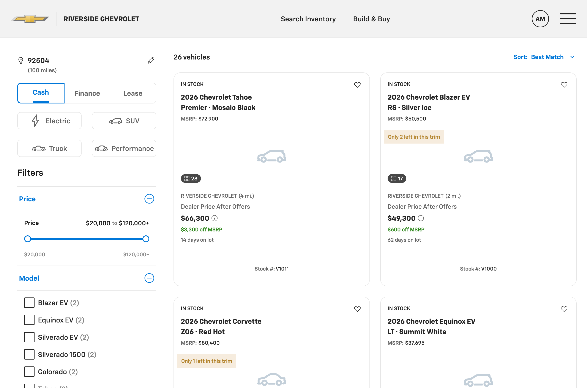
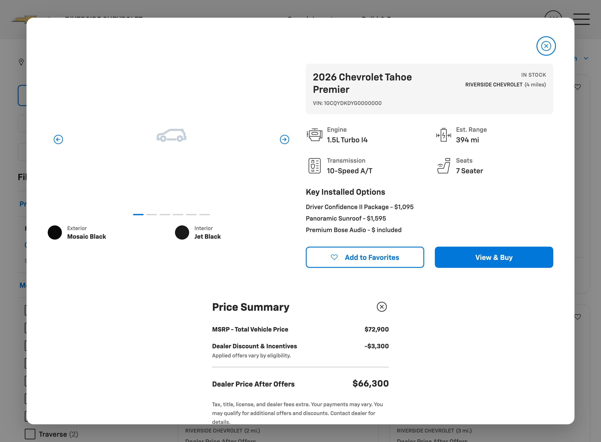
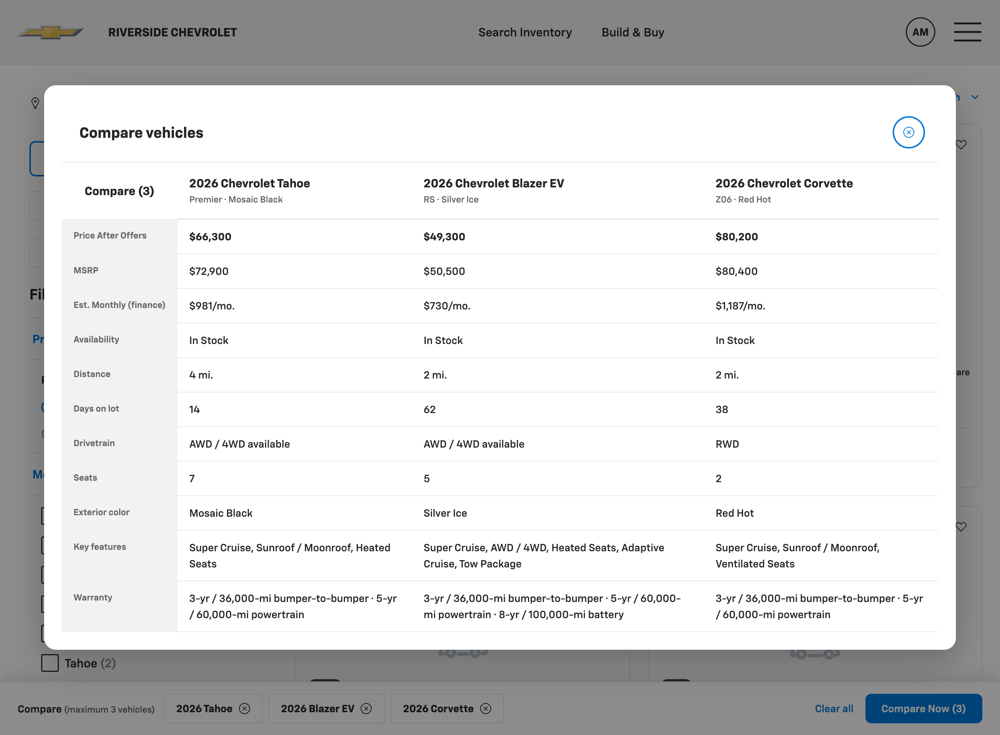
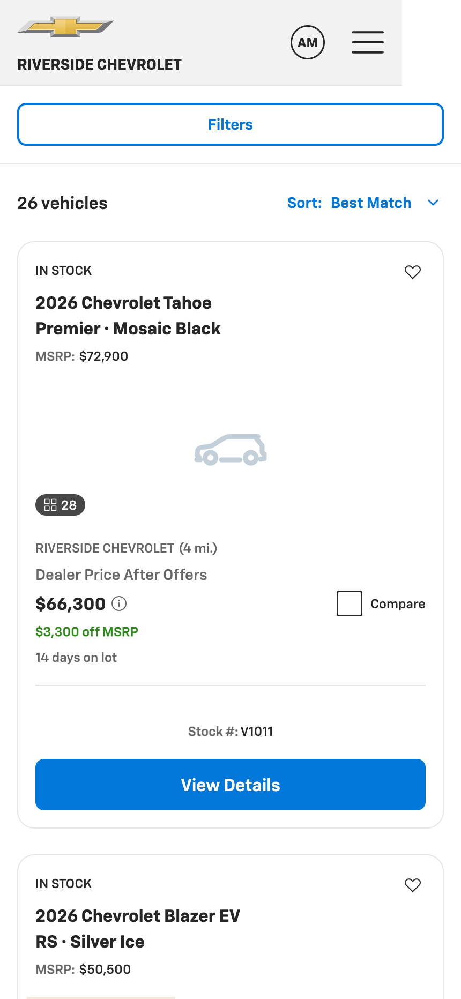
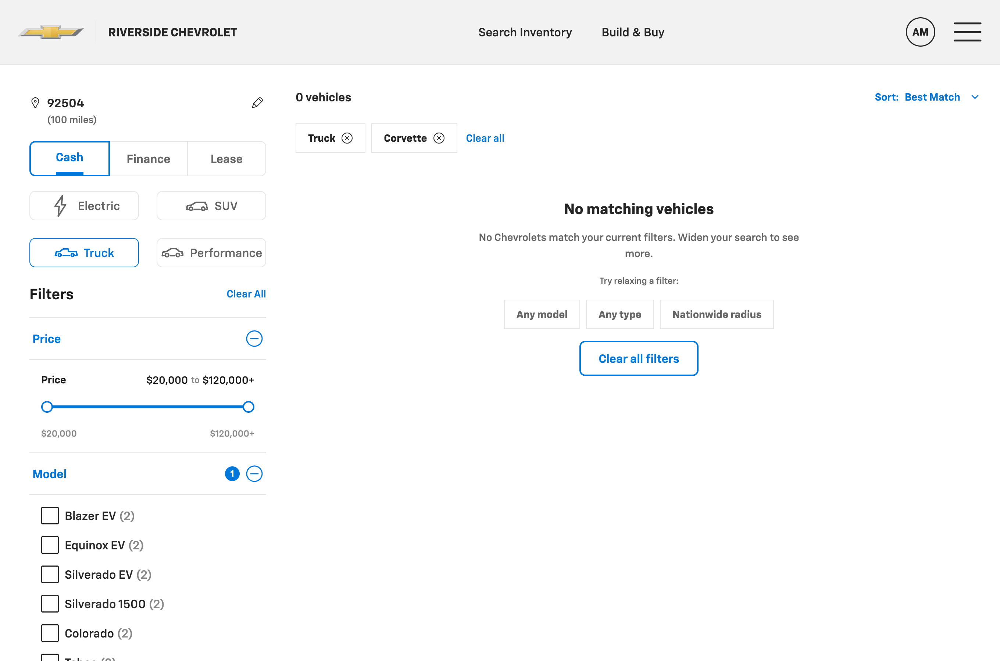
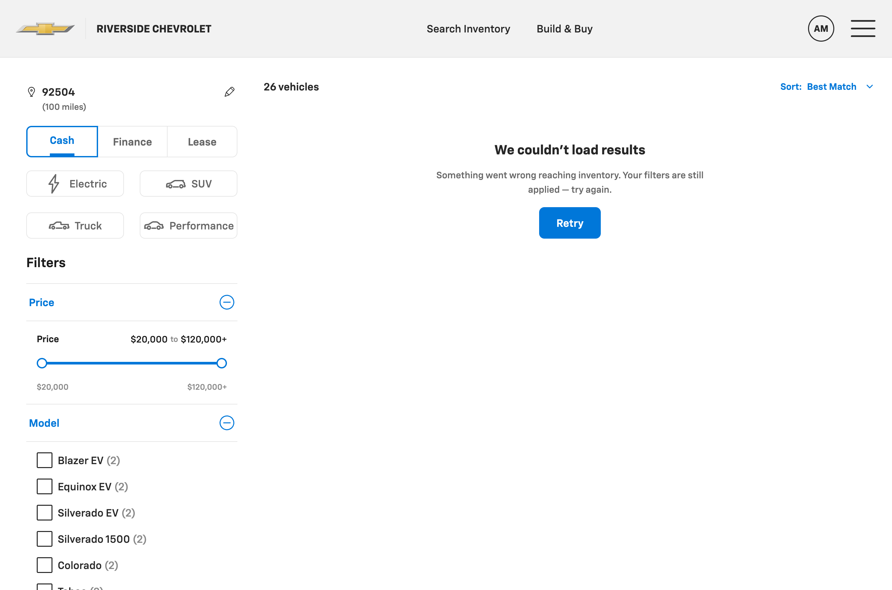

# gm-vsr — POC Report

**Chevrolet Vehicle Search Result page (VSR), built with a spec-driven, design-system-grounded AI workflow in Claude Code**

**Owner:** jrajan  |  **Design system:** Alloy (GM Digital Retail Program)  |  **Date:** 2026-07-30

> *This report is written to be accurate, not persuasive. Cost/time figures in §7 are actual values from Claude Code's `/cost`; the "what was hard" and "limitations" sections are as important as the results.*

---

## 1. Summary

Starting from a pasted PRD, we produced a **working Chevrolet VSR prototype** in one session. It runs in a browser, consumes the **Alloy** design system as a read-only source of truth (its real CSS classes and tokens), and covers the jobs in the PRD: filter, gauge affordability, save, compare, and link out to the VDP.

**What it is:** a functional, on-brand, responsive front-end prototype in vanilla HTML/CSS/JS that reuses Alloy's stylesheet, plus a full artifact chain (constitution → spec → plan → tasks → drift log).

**What it is not:** production code, a real integration (data is mocked), or a multi-brand build (Chevrolet only). It required an engaged human reviewer throughout — it was not autonomous.

Cost was **$102.35** over **~1h 45m** of active session time.

---

## 2. Visual evidence

Screenshots captured headless from the running prototype. Full-resolution files in `screenshots/`.

*Desktop VSR — Alloy header, filter rail (instant apply, live count), result cards, sort menu.*

*Quick View (`vsr-quick-view`) + itemized Price Summary (`vsr-math-box`).*

*Compare — side-by-side spec table (up to 3) + sticky, session-persistent tray.*

*Mobile — brand-only header, full-width Filters sheet trigger, mobile card variant.*

*Zero-result state with relaxed-filter suggestions.*

*API-failure state — error copy + Retry (filters preserved).*

---

## 3. What was built

| Area | Delivered |
|---|---|
| Shell | Alloy tier-3 header + footer; responsive rail-vs-results layout (desktop / tablet / mobile) |
| Filter panel | Instant-apply desktop with live count; mobile bottom-sheet with Apply (N) / Clear all; collapsible Price · Model · Color · Features; editable ZIP + search radius (radius filters by distance) |
| Active filters | Removable chips + Clear all |
| Result cards | PRD data fields; cash / finance / lease payment; APR tooltip; favorite heart; photo-count badge; days-on-lot; low-inventory overlay |
| Sort & paging | "Best Match" (+ 4 sorts) via Alloy menu; desktop 24/page numbered pager; mobile infinite scroll (12 at a time) |
| Quick View | Desktop modal + itemized Price Summary |
| Compare | Sticky tray (max 3, session-persistent) + side-by-side spec table |
| States | Skeleton loading, zero-result + suggestions, partial-match banner, error + retry, low-inventory |
| Persistence | Filters, favorites, compare tray persist within the session — no login |
| Quality bar | Responsive at 600 / 1024; motion + `prefers-reduced-motion`; keyboard focus rings; ≥40px tap targets; AA contrast; CTA link-outs |

Each step was verified in a live browser (filter math, staged mobile apply, pagination, compare limits, and each state were exercised), not only visually reviewed.

---

## 4. How it was done — the workflow

1. **Scaffold** — a *constitution* pins the project to Alloy and inherits its visual direction.
2. **Spec** — the pasted PRD becomes a full spec (problem, scope, flows, component map, four-state matrix, acceptance criteria). It scored completeness and asked targeted questions where the PRD was ambiguous (brand scope, gap handling, flow boundary, out-of-scope).
3. **Plan + tasks** — 10 checkpointed build steps, each re-reading the spec and stopping for review.
4. **Build** — step by step, verified in-browser, checkpointed with the designer between steps.

---

## 5. Design-system fidelity & governance

- **Alloy-grounded, Chevrolet only.** No hardcoded brand hex, no invented token namespaces.
- **Read-only enforced.** Nothing under `design-systems/alloy/` was modified; nothing outside `projects/gm-vsr/` was touched.
- **8 gaps flagged, not faked** — needs Alloy doesn't cover yet, built net-new from Alloy atoms and logged in the constitution: compare tray, compare modal, numbered pagination, skeleton loader, photo-count badge, days-on-lot field, plain form-select, global surface/text tokens. Whether these are valuable depends on the design-system team acting on them — on their own they're a byproduct of building against the real system, not a deliverable.
- **Full drift log** — every deviation and judgment call recorded in `tasks.md`.

---

## 6. What went well, and what was hard

**Went well**
- Clarifying questions up front prevented building the wrong thing (brand scope, out-of-scope were settled before code).
- The output reads as genuine Alloy UI because it reuses Alloy's actual classes, not approximations.
- In-browser verification caught real bugs during the build rather than after.
- The artifact chain makes every decision auditable by someone who wasn't in the session.

**Was hard / friction (the honest part)**
- **My cost estimate was wrong.** I estimated $30–60; actual was $102.35 — ~2× low. I underweighted cache-read volume.
- **Bugs surfaced mid-build and needed iteration** — e.g. Alloy's CSS overriding the HTML `hidden` attribute (empty badges showing), and a breakpoint desync between the JS and CSS. Normal engineering, but not first-try-correct.
- **The spec didn't map cleanly everywhere.** The PRD's "partial-match by trim" had no trim filter to hang on, and the card "status pill" is plain text in Alloy — both required judgment calls, recorded as drift rather than silently resolved.
- **The design system has its own gaps.** Alloy lacks global surface/body-text tokens, so the shell reused Alloy's own fallback literals — acceptable, but not clean.
- **Verification tooling added overhead.** The embedded preview pane didn't fire resize/matchMedia events on programmatic resize and dropped bands from some screenshots, so responsive/visual checks needed workarounds (reload-at-size, and a headless browser for the report screenshots).
- **It needed a human at every checkpoint.** Several designer redirects (compare placement, hover reveal, low-inventory overlay, removing a CTA) shaped the result. This is a strength for control, but it means the workflow is assisted, not autonomous.

---

## 7. Cost breakdown (actual, from `/cost`)

### 7.1 Measured totals

| Metric | Value |
|---|---|
| Total cost | **$102.35** |
| Active time | 1h 45m (API compute 1h 39m) |
| Code produced | +3,467 / −482 lines |
| Model | Opus 4.8 · 100% (no Haiku) |
| Cache hit rate | 95% |
| Tokens (reported) | cache read 203.0M · cache write 10.7M · output 8.7k · input 1.2k |

### 7.2 Token composition (~213.7M total)

| Category | Tokens | Share | What it is |
|---|---:|---:|---|
| Cache read | 203.0M | ~95% | Re-reading the working context each turn — Alloy source, artifact chain, prior conversation, ~20 verification screenshots |
| Cache write | 10.7M | ~5% | First-time ingest of that context into the cache |
| Output | 8.7k | <0.01% | Newly generated tokens (as reported) |
| Input | 1.2k | <0.01% | Uncached prompt tokens |

Cost is dominated by context re-reads, not generation. The 95% cache-hit rate held it at ~$100; without caching it would have been several times higher. The most expensive single content type was verification screenshots (images cost the most per item) — which is also a lever (see below).

> Note: `/cost` does not itemize dollars per token category, and the reported output count (8.7k) is lower than the +3,467 lines of code would imply, so the per-category numbers above are volumes as displayed, not a reconciled dollar split. The authoritative figure is the **$102.35 total**.

### 7.3 Unit economics (derived from the $102.35 total)

| Unit | Cost |
|---|---|
| Per million tokens processed (blended) | ~$0.48 |
| Per active hour | ~$58 |
| Per build step (10 steps) | ~$10 |
| Per line of code produced | ~$0.03 |

### 7.4 Reading the cost honestly

- **$102 for one prototype screen is real money.** It's favorable *if* the alternative is days of designer + engineer time — but that comparison is an unmeasured estimate, not a benchmark, and this was a single screen with an engaged reviewer, not a hands-off batch.
- **The cost is front-loaded in context.** Most spend is re-reading the design system and the growing session. That implies the per-screen cost should fall when the design-system extraction is reused across projects — a **projection**, not something this POC proved.
- **Levers, in priority order:** reuse the design-system extraction across projects; prefer DOM assertions over screenshots for verification; run longer autonomous stretches between checkpoints.

---

## 8. Assessment & recommendation

**Assessment:** for turning a written spec into a working, on-brand, verified prototype on an existing design system, this was effective — one screen in one session for ~$100, with an auditable trail and no off-brand invention. The caveats are equally real: it's a prototype not production, it needed continuous human review, several things took more than one try, and the per-screen economics at scale are a projection.

**Suggested next steps (each with a cost/effort implication):**
- **Try it on 2–3 more screens** to test whether per-screen cost actually drops with design-system reuse — the key open question.
- **Route the 8 flagged Alloy gaps** to the design-system owner as a backlog.
- **If pursued further:** Buick/GMC/Cadillac theming, live API wiring, and hardening the net-new pieces into real Alloy components — all additional work beyond this POC.

---

## Appendix — where to look

- **Live prototype:** `projects/gm-vsr/index.html` (served locally during review)
- **Artifact chain:** `constitution.md` · `spec.md` · `plan.md` · `tasks.md` (incl. drift log) · `brief.md` (original PRD, verbatim — still uses the shopper's original "VRP" wording)
- **Code:** `scripts/` (data, filter, results, compare, quickview, shell) · `styles/shell.css` (project layout only — component styling comes from Alloy)
