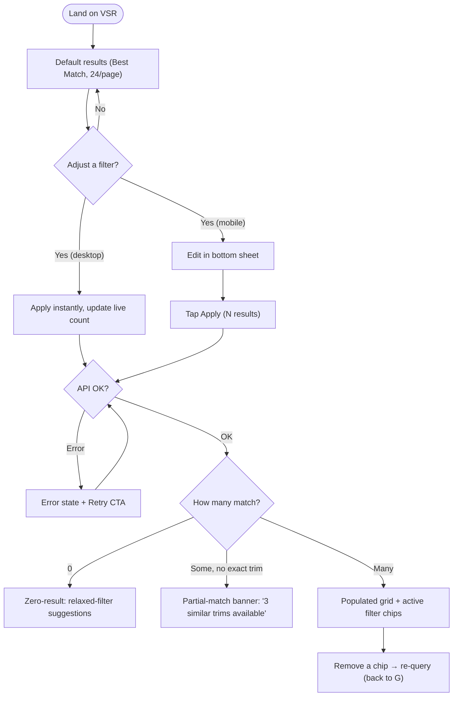
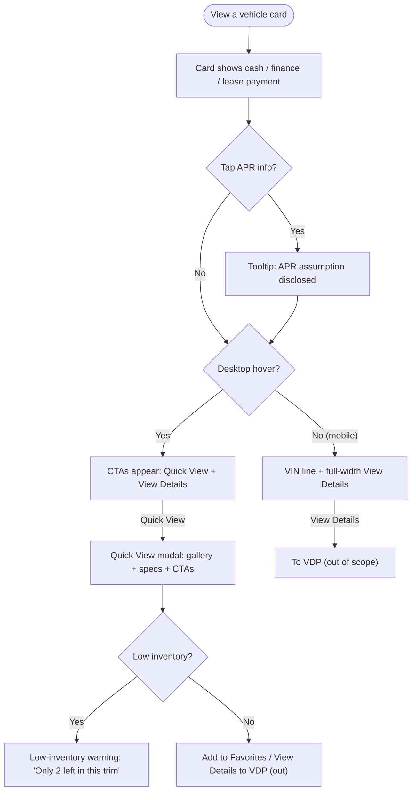
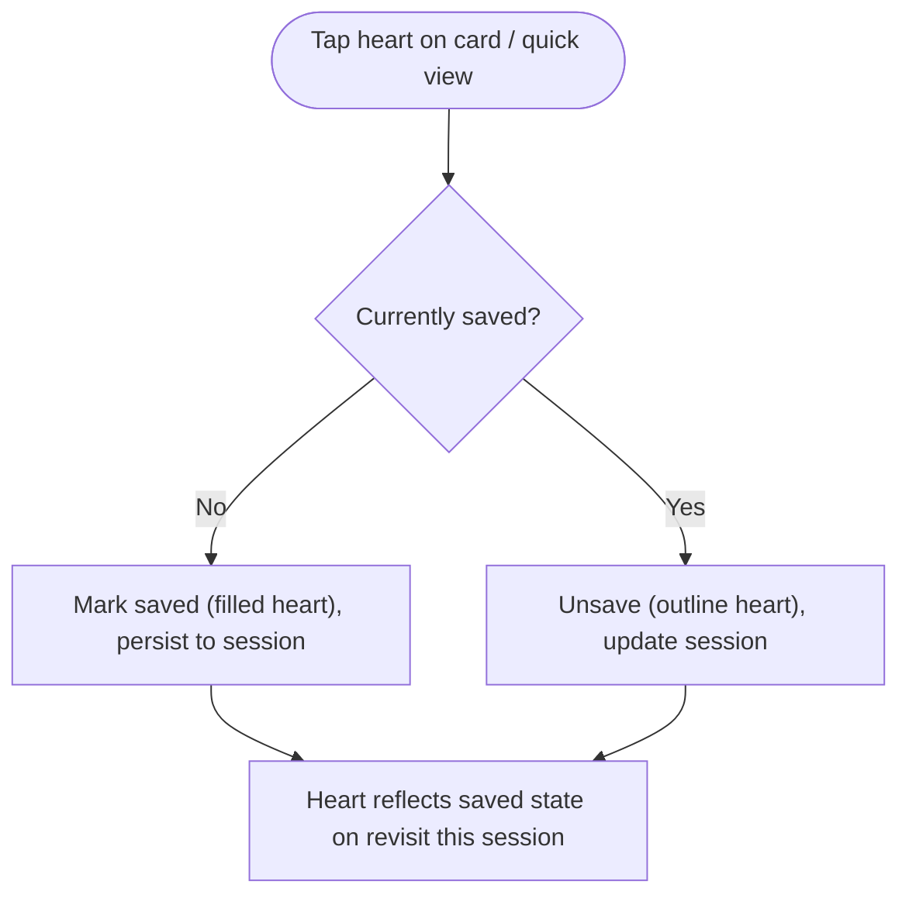
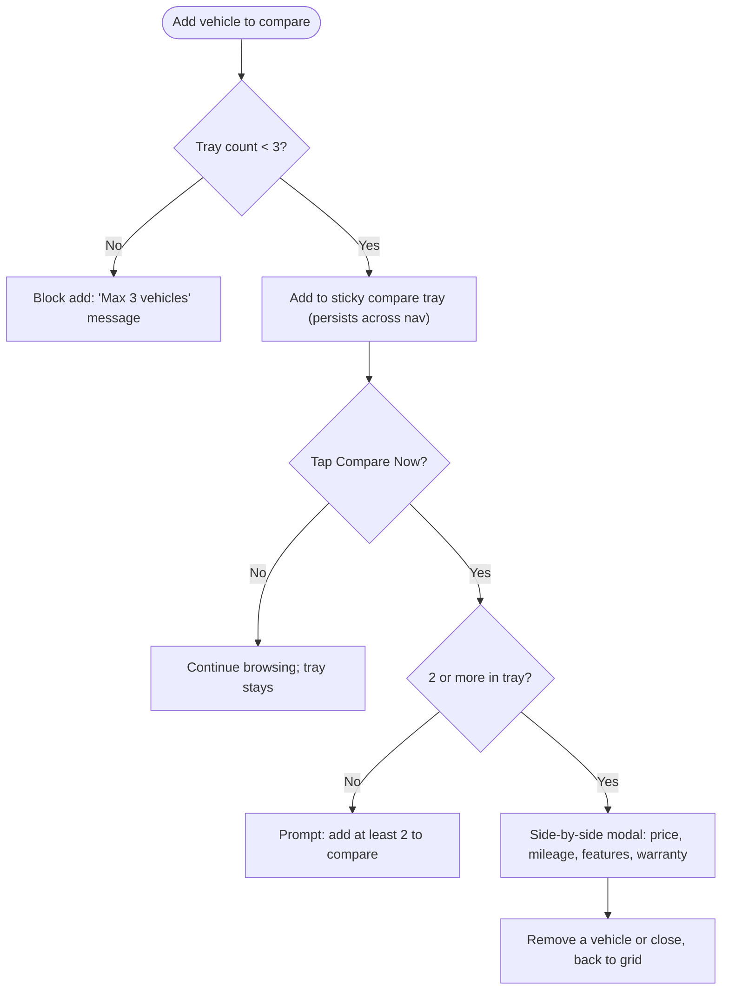
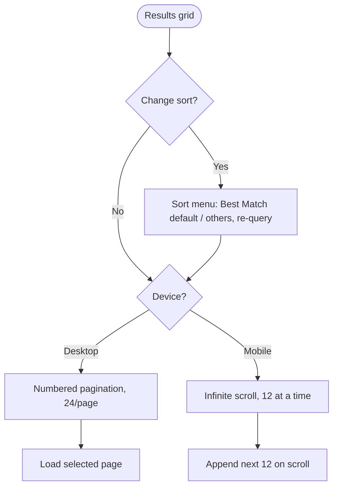

# gm-vsr — Spec

> A Chevrolet **Vehicle Search Result page (VSR)**: a filterable, sortable inventory grid where an anonymous shopper narrows Chevrolet inventory by model/trim/price, gauges affordability via an estimated monthly payment (no login), saves vehicles, and compares up to three side-by-side — all so more shoppers click through to the Vehicle Detail Page (VDP) and start a lead. It is for online Chevrolet shoppers (including returning visitors, whose last-used filters persist for the session). It lets them filter, sort, page through results, quick-view a vehicle, favorite it, compare, and launch the VDP or "Get Pre-Approved" flow.

**Owner:** jrajan  |  **Last updated:** 2026-07-30
**Source:** [brief.md](brief.md) (PRD pasted by owner, 2026-07-30)  |  **Design system:** alloy (Chevrolet only)
**Completeness:** Problem *High (shortfall confirmed 2026-07-30)* · Scope *High (resolved via Q&A)* · Flows *built* · Components *High* · States *High* · Acceptance *High*. No open `{{TODO}}` markers remain.

> **How to use this file:** The two biggest failure modes are *ambiguity* (Claude fills gaps with guesses) and *drift* (Claude forgets decisions over a long session). This spec kills ambiguity up front. Be concrete: name real components, real states, real copy. Vague specs produce vague UI.

---

## Problem

- **Who** is the user? An anonymous online **Chevrolet shopper** browsing dealer inventory, plus the **returning visitor** whose last-used filters persist within the session. No account required.
- **What** are they trying to accomplish? Narrow inventory to relevant Chevrolets, judge affordability (estimated monthly payment) up front, shortlist via favorites and compare, and get to the right VDP / start a lead.
- **Why** does the current experience fall short? Today's VSR has **weak / slow filtering** — shoppers can't narrow to relevant Chevrolets quickly (no instant apply, poor grouping, high zero-result rate), which drags out time-to-first-click and suppresses **VDP click-through** and **lead-form starts**. This spec targets that directly: instant desktop apply with a live count, most-used groups (Model/Price) expanded by default, removable chips, and zero-/partial-result recovery.

**Success metrics (from brief, tracked — not built here):** filter usage rate · avg. time-to-first-click · zero-result rate · compare-tray usage · "Get Pre-Approved" click rate.

## Scope

**In scope:**
- Chevrolet-only VSR (Vehicle Search Result page); Chevrolet base tokens only.
- **Filter panel** — desktop persistent left rail, filters apply **instantly** with a live result count; mobile **bottom-sheet** with sticky "Apply (N results)" + "Clear all". Collapsible groups (Price, Model, Color, Features); Model + Price expanded by default.
- **Editable location** — the ZIP / radius header is editable: edit the ZIP (validated 5-digit) and pick a **search radius** (10/25/50/100/200 mi / Nationwide); radius filters results by distance. Location is search *context* — preserved across "Clear all".
- **Active filter chips** above results, each individually removable.
- **Vehicle result cards** with the brief's §3 data fields; cash / finance / lease payment display; APR assumption disclosed via tooltip.
- **Estimated monthly payment shown anonymously** (no login).
- **Save / favorite** a vehicle (session-based, anonymous).
- **Sort** ("Best Match" default) + **pagination** (desktop 24/page numbered; mobile infinite scroll, 12 at a time).
- **Compare** — sticky tray (max 3, session-persistent) → "Compare Now" side-by-side spec modal.
- **Session-persisted last-used filters.**
- **States:** loading (skeleton cards), zero-result (relaxed-filter suggestions), partial-match, error/API failure (retry), low-inventory warning.
- **CTAs:** View Details / Quick View → VDP (**link out only**). _(A "Get Pre-Approved" CTA was removed from the VSR UI on 2026-07-30 at the owner's request.)_

**Explicitly out of scope:** (these stop drift)
- **Login / account / auth** — everything anonymous, session-based only.
- **Real search backend / API** — design against mock inventory; no live integration.
- **Dealer / admin inventory tools** — no back-office, pricing admin, or dealer screens.
- **Saved-vehicles dashboard** — the heart toggles state; no dedicated "my saved vehicles" listing page this round.
- **The VDP and the pre-approval / lead form destinations** — CTAs link out; the destinations are not built here.
- **Buick / GMC / Cadillac brand theming** — Chevrolet only this round (other brands are a later `[data-brand]` pass).

---

## User Flows

Each flow is one sentence + a `flowchart TD`, covering unhappy paths (empty, error, partial).

### Flow 1: Filter & browse

Shopper refines Chevrolet inventory and the grid updates live (desktop) or on Apply (mobile), handling zero-result, partial-match, and API-error paths.

### Flow 2: Gauge affordability & quick view

Shopper reads an estimated monthly payment (with APR tooltip) without logging in, and can open a desktop Quick View before deciding to visit the VDP.

### Flow 3: Save / favorite

Shopper toggles a heart to shortlist a vehicle; state persists for the session without an account.

### Flow 4: Compare

Shopper adds up to three vehicles to a sticky tray that survives navigation, then opens a side-by-side spec modal.

### Flow 5: Sort & paginate

Shopper changes sort or moves through pages, with device-specific paging behavior.

---

## Components

Every row maps to a real **alloy** component, or is flagged as a **GAP** (net-new, logged in constitution §4). No UI is invented — gaps are built net-new and recorded for maintainer follow-up.

| Component | Design-system source | Notes |
|-----------|----------------------|-------|
| Page shell / chrome | alloy `header`, `footer` | Chevrolet brand; standard VSR chrome |
| Filter panel (rail / sheet) | alloy `vsr-filter` | Desktop 354px rail instant-apply + live count; mobile full-bleed sheet with sticky Apply (N) / Clear All |
| Location editor — ZIP | alloy `text-input` (standard outlined) | 5-digit validated; inline error on invalid |
| Location editor — radius | **GAP** (§4) — form-select | Alloy documents a dropdown text-input + popover menu, not a plain form-select; small net-new control styled to match |
| Filter category groups | alloy `accordion` | Collapsible; **Model + Price expanded by default**, Color/Features collapsed |
| Price range control | alloy `slider` | Range slider (net price); single slider in Finance/Lease context |
| Payment-context switch | alloy `tabs` (contained) | Cash / Finance / Lease — drives payment display (Alloy notes S26 per-brand drift; N/A here, Chevrolet only) |
| Filter option lists | alloy `checkbox` | Multi-select options within groups |
| Quick filters | alloy `quick-filter` | Electric · SUV · Truck · Performance row |
| Active filter chips | alloy `chip` (removable) | Above results; each individually removable |
| Vehicle result card | alloy `vsr-card` | Core §3 fields; cash/finance/lease term block; status pill; hover → Quick View + View Details |
| — Photo-count badge | **GAP** (§4) | Overlaid on primary photo; align to Alloy's future Badge atom |
| — Days-on-lot field | **GAP** (§4) | Not in documented `vsr-card` anatomy; net-new field |
| — Distance-from-user field | **GAP** (§4) | Geolocation-gated; net-new field |
| APR assumption tooltip | alloy `tooltip` | Discloses APR assumption on estimated payment |
| Save / favorite | alloy `icon-button` (heart) | Toggles saved state; session-based |
| Price summary panel | alloy `vsr-math-box` | Itemized pricing (cash/finance/lease × availability); used in Quick View / detail contexts |
| Quick View modal | alloy `vsr-quick-view` | **Desktop-only** preview from card CTA; gallery + specs + Add to Favorites / View Details |
| Sort control | alloy `menu` | Dropdown; "Best Match" default |
| Numbered pagination (desktop) | **GAP** (§4) | 24/page numbered pager; no catalog component |
| Infinite scroll (mobile) | behavior over `vsr-card` | 12 at a time; not a component |
| Compare tray (sticky) | **GAP** (§4) | Max 3, session-persistent sticky bottom bar |
| Compare modal (side-by-side) | **GAP** (§4) | Spec table (price, mileage, features, warranty); `vsr-quick-view` is single-vehicle |
| Skeleton loader | **GAP** (§4) | Skeleton VSR cards for loading (not spinners) |
| Zero-result / relaxed suggestions | alloy `chip` + `inline-button` (composition) | Empty-state layout is net-new composition of atoms |
| Low-inventory warning | alloy `chip` (warning color) | "Only 2 left in this trim" |
| Partial-match banner | alloy `chip` / `link` (composition) | "3 similar trims available" |
| Retry CTA (error) | alloy `button` | Matches `vsr-filter` GD Error variant's retry |

---

## States

Four states per surface. (Where a real state can't occur — e.g. a persistent shell has no "empty" — it's marked N/A with the reason.)

| Screen / component | Empty | Loading | Error | Success / populated |
|--------------------|-------|---------|-------|---------------------|
| Results grid | Zero-result: headline + relaxed-filter suggestions (loosen price/trim) + "Clear all" | **Skeleton cards** (GAP), count reads "Searching…" | API failure copy + **Retry** button; filters preserved | Grid of `vsr-card`s + active chips + live count; **partial-match** banner when no exact trim |
| Filter panel (`vsr-filter`) | Default groups (Model/Price expanded); no chips yet | Rail inert / disabled (50% opacity) while first query resolves | GD Error payment payload + Retry CTA | Selected options reflected as chips + count badges; live "N results" |
| Vehicle card (`vsr-card`) | N/A (a card only renders with a vehicle) | Skeleton card (GAP) | N/A (card-level errors bubble to grid error) | Full card: photo + count badge (GAP), status pill, payment block, heart; **low-inventory** warning when qty ≤ threshold |
| Compare tray (GAP) | Hidden when 0 selected | N/A | "Max 3 vehicles" block when adding a 4th | 1–3 chips of selected vehicles + "Compare Now" |
| Compare modal (GAP) | Prompt to add ≥ 2 vehicles | Skeleton spec rows while specs load | Per-row "—" for missing spec + inline retry | Side-by-side spec table (price, mileage, features, warranty) |
| Quick View (`vsr-quick-view`) | N/A (opens for a specific vehicle) | Gallery/spec skeleton while loading | Load-failure copy + close | Gallery + specs + Add to Favorites / View Details |

---

## Acceptance criteria

Concrete, checkable behaviors — these become the tasks.

**Filtering**
- The desktop filter rail is persistent; changing any filter re-queries **instantly** (no Apply button) and updates the live result count.
- The mobile filter panel opens as a bottom sheet with a sticky **"Apply (N results)"** and **"Clear all"**; results update only on Apply.
- Filter groups are collapsible; **Model and Price are expanded by default**, Color and Features collapsed.
- Each active filter renders as a removable **chip** above the results; removing a chip re-queries.
- The **location is editable**: the pencil opens a ZIP field (rejects non-5-digit input with an inline error) + a search-radius selector; applying updates the header and re-queries (radius filters by distance). "Clear all" preserves the location.
- The last-used filters persist across a page reload **within the same session** (no login).

**Cards & payment**
- Each card shows: Year, Make, Model, Trim, Ext/Int color, MSRP, dealer discount/incentive, estimated monthly payment, availability status (In Stock / In Transit / Factory Order), primary photo. VIN is present but hidden (used for the VDP link).
- The estimated monthly payment is visible **without logging in**; tapping the APR affordance opens a **tooltip** disclosing the APR assumption.
- Photo-count badge, days-on-lot, and distance-from-user render on the card **(GAP — net-new)**; distance appears only when geolocation is enabled.
- Tapping the heart toggles saved/unsaved and persists for the session.
- When a trim's inventory is low, the card shows a **"Only N left in this trim"** warning.

**Sort & pagination**
- Default sort is **"Best Match"** (availability + distance + incentive weighting); a sort **menu** offers alternatives.
- Desktop paginates at **24/page** with numbered pagination **(GAP)**; mobile uses **infinite scroll, 12 at a time**.

**Compare**
- A shopper can add up to **3** vehicles to a **sticky compare tray** that persists across navigation within the session; adding a 4th is blocked with a "Max 3" message **(GAP)**.
- **"Compare Now"** opens a side-by-side modal with a spec table (price, mileage, features, warranty) **(GAP)**; it requires ≥ 2 vehicles.

**States**
- Loading shows **skeleton cards**, never spinners **(GAP)**.
- A zero-result query shows relaxed-filter suggestions.
- A near-miss shows a **partial-match** message ("3 similar trims available").
- An API failure shows an error state with a **Retry** CTA that preserves current filters.

**Flow boundary**
- **View Details / Quick View → VDP** is a link-out; the destination is not built in this project.
- _(The "Get Pre-Approved" CTA was removed from the VSR UI on 2026-07-30 at the owner's request; the metric remains in the brief but there is no in-page CTA this round.)_

**Guardrails**
- Only **alloy** Chevrolet tokens/components are used; the six items marked **GAP** are the only net-new UI and are logged in constitution §4.
- Nothing outside `projects/gm-vsr/` is modified.
