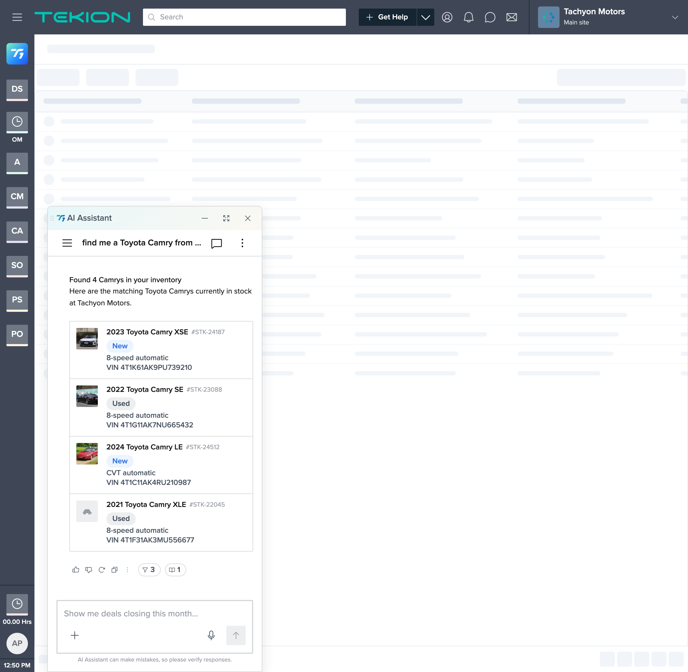
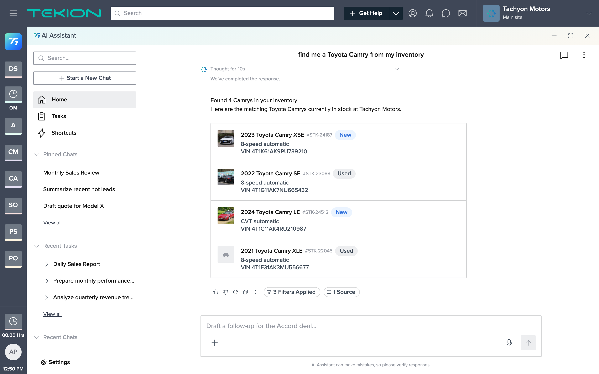
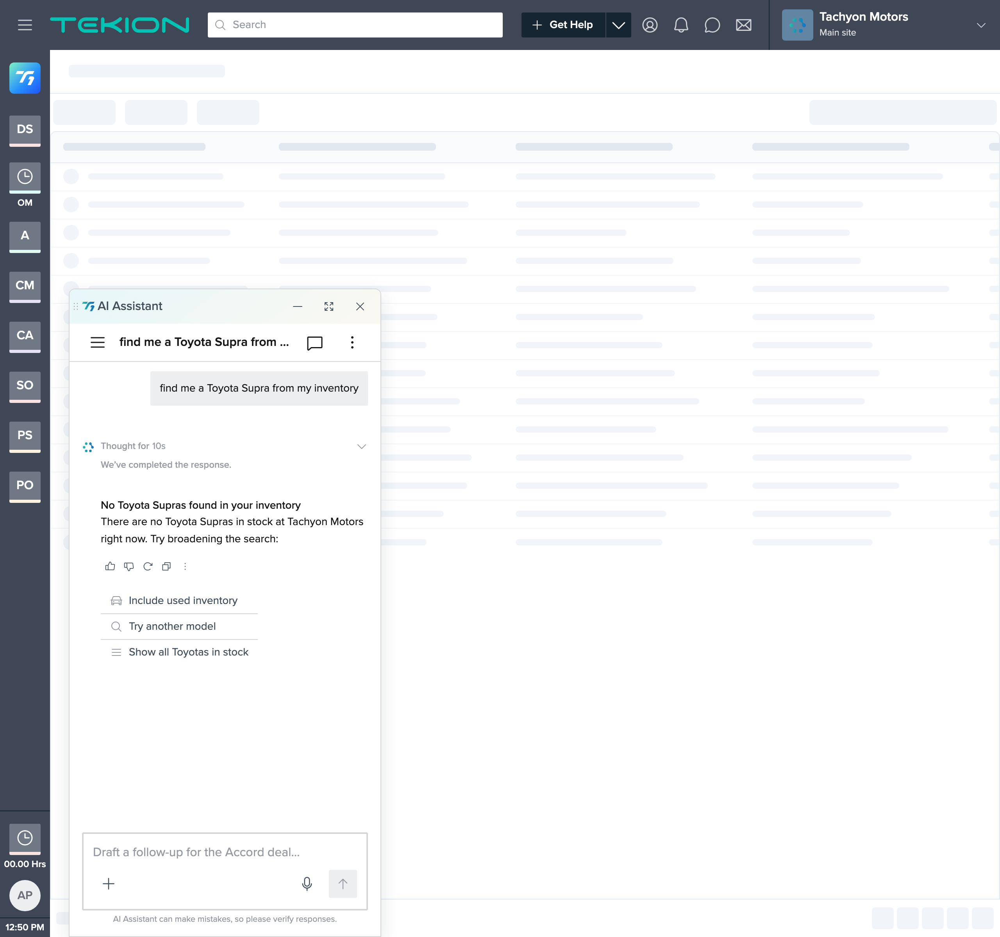
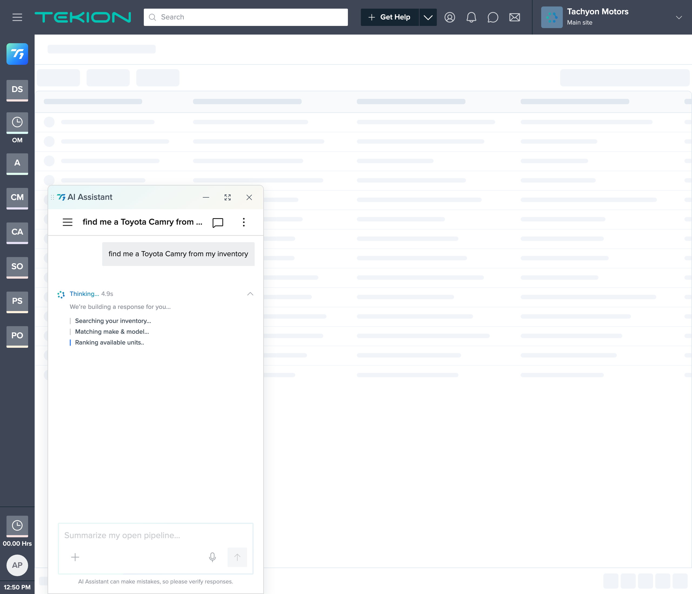
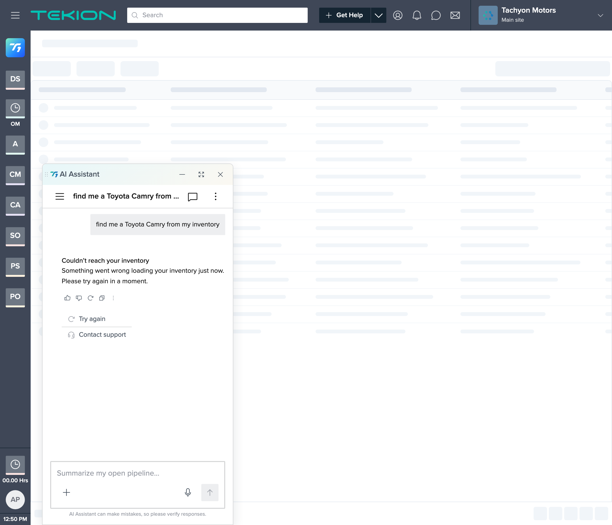

# t1-vehicle-search — POC Report

**Tekion T1 AI assistant — in-chat vehicle inventory search, built with a spec-driven, design-system-grounded AI workflow in Claude Code**

**Owner:** jrajan  |  **Design system:** T1 (Tekion T1 AI Sales Assistant)  |  **Date:** 2026-07-30

> *This report is written to be accurate, not persuasive. Cost/time figures in §7 are actual values from Claude Code's `/cost`; the "what was hard" and "limitations" sections are as important as the results.*

---

## 1. Summary

Starting from a one-line ask — *"when a user asks to find a Toyota Camry from inventory, T1 should reply with a count and show vehicle cards (YMMM, VIN, Stock#, image, New/Used, transmission)"* — we produced a **working T1 vehicle-search response** in one session. It runs in a browser, consumes the **T1** design system as a read-only source of truth (its real component bundle and tokens), and covers the ask plus the three unhappy states (empty, loading, error).

**What it is:** a functional, on-brand prototype — a fork of T1's canonical `chat-interface.html` (React via in-browser Babel), seeded to land on the inventory-search scenario — plus a full artifact chain (constitution → spec → plan → tasks → drift log) and per-step visual reviews.

**What it is not:** production code; a real integration (the 4 results, VINs, and stock numbers are mocked); or a general search (it's a single seeded flow — one make/model query — not the whole assistant). The natural-language query→inventory mapping was explicitly **out of scope** — this is the response UI only. The vehicle images are royalty-free **stock photos of other cars** (an Audi, a Maserati, a Celica), not the labeled Camrys and not licensed dealer photos. It **does not open by double-click** — it needs a local static server. It required an engaged human reviewer at every checkpoint — it was not autonomous.

Cost was **$31.23** over **~50 minutes** of active session time. Note this is a **much smaller scope** than a full page build, so the low figure reflects less work, not a proven efficiency (see §7.4).

---

## 2. Visual evidence

Screenshots captured headless from the running prototype. Full-resolution files in `screenshots/`.

*Docked AI panel — "Found 4 Camrys in your inventory" + one `ListingCard` (photo · YMMM · VIN · Stock# · New/Used chip · transmission). Photos are stock placeholders and do not match the labeled trims.*

*Same result in the full-screen assistant surface, with T1's SideNavigation.*

*No-match state — "No Toyota Supras found in your inventory" + `SuggestionList` to broaden the search; no card.*

*Searching state — in-progress `ReasoningLog`, no results card yet, composer disabled.*

*Inventory-lookup failure — error copy + "Try again" / "Contact support"; no card.*

---

## 3. What was built

| Area | Delivered |
|---|---|
| Shell | Fork of T1's canonical `chat-interface.html`; locked Tekion chrome (`.ts-menubar` / `.ts-body`) left untouched; docked-popover + full-screen surfaces |
| Result | AI `Response` with a sentence-case count summary + one `ListingCard` of 4 vehicle rows |
| Row fields | YMMM (title), VIN (description), Stock# (id), New/Used (`Chip`), transmission (subtitle), vehicle photo (see deviation) — display-only rows |
| States | Results (success), empty + broaden-search suggestions, loading/searching (`ReasoningLog`), error + retry |
| Photo thumbnail | Vehicle photo painted into the `ListingCard` avatar slot; neutral placeholder for the no-photo row (row 4) |
| Review affordances | `?scenario=match\|empty\|loading\|error` and `?panel=popover\|left\|right\|fullscreen` seed switches, so each state/surface is reviewable in isolation |

Each step was verified in a live browser — not only eyeballed — with DOM assertions for facts a screenshot can't prove (1 card / 4 rows, no pointer cursor on rows, no results card during loading, and a diff confirming the locked shell CSS was unchanged).

---

## 4. How it was done — the workflow

1. **Scaffold** — a *constitution* pins the project to T1 and inherits its visual direction and hard rules (tokens only, Phosphor only, never rebuild the shell).
2. **Spec** — the one-line ask became a full spec (problem, scope, flows, component map, four-state matrix, 11 numbered acceptance criteria). It scored the ask for completeness and asked 4 targeted questions where it was ambiguous (card layout, how to handle the image, row interactivity, empty-state behavior).
3. **Plan + tasks** — 6 checkpointed build steps, each re-reading the spec and stopping for review; every task traces to an acceptance criterion.
4. **Build** — step by step, verified in-browser, checkpointed with the designer between steps.

---

## 5. Design-system fidelity & governance

- **T1-grounded.** Real T1 components (`ChatBubble`, `Response`, `ListingCard`, `Chip`, `SuggestionList`, `ReasoningLog`) and `var(--t1-*)` tokens; no hardcoded colors in the added styling; no third-party UI; Phosphor icons only.
- **Read-only enforced.** Nothing under `design-systems/t1/` was modified; nothing outside `projects/t1-vehicle-search/` was touched. The locked Tekion chrome was verified **byte-identical to the template** by diff.
- **1 deviation flagged, not faked.** T1's `ListingCard` has no image prop and *intentionally hides its avatar in the narrow panel*; showing a vehicle photo there required a fork-level CSS workaround plus an override of that hide. Both are recorded in `constitution.md §5` and were **explicitly signed off** by the designer. This is a candidate upstream kit change (a real `image`/`thumbnail` prop on `ListingCard`), now captured in T1's "Known gaps" doc. On its own it's a byproduct of building against the real system, not a deliverable.
- **Full drift log** — every deviation and judgment call recorded in `tasks.md`.

---

## 6. What went well, and what was hard

**Went well**
- The 4 clarifying questions up front settled ambiguity (card layout, image handling, interactivity, empty behavior) before any code.
- The output reads as genuine T1 because it composes T1's actual components and tokens, not approximations; the shell was provably untouched.
- In-browser + DOM-assertion verification caught a real issue (the avatar being hidden in the narrow panel) that a glance would have missed.
- The artifact chain + per-step screenshot reviews make every decision auditable by someone who wasn't in the session.

**Was hard / friction (the honest part)**
- **My cost estimate was wrong.** I estimated $10–25; actual was $31.23 (~1.3–3× low). I underweighted cache-read volume — the same failure mode worth flagging on any of these.
- **The brief's core requirement wasn't natively supported.** "An image per vehicle" has no home in T1's `ListingCard` (it renders a letter avatar). It only works via a fork-level CSS workaround, and I initially **misjudged in Step 2 that the avatar was rendering** when it was actually hidden by a container query — caught in Step 3, not first-try-correct.
- **The deliverable doesn't open by double-click.** After handoff the designer hit `TypeError: Failed to fetch` — the T1 loader uses `fetch()`, which browsers block on `file://`. It needs a local server. This is a genuine sharing gap that only surfaced post-build.
- **The stock-photo fetch was unreliable.** Of the images pulled, two were unusable (a car undercarriage on jack stands, a hood-open vintage car) and were discarded after inspection; the usable three are the **wrong makes** for the labels (Audi/Maserati/Celica shown as Camrys). Real dealer photos would be needed for anything beyond a mock.
- **A copy inconsistency slipped through.** The empty-state first paired a "Ferrari" query with "Camry" wording; caught and corrected to a single model (Toyota Supra).
- **Verification tooling added overhead.** The interactive preview restarted the panel's open-animation on resize (the panel briefly "vanished" mid-capture once), so I used a headless browser and `?scenario=`/`?panel=` seed switches for clean, isolated frames.
- **It needed a human at every checkpoint.** The narrow-panel override sign-off and the real-photo swap were designer decisions; the flow is assisted, not autonomous.

---

## 7. Cost breakdown (actual, from `/cost`)

### 7.1 Measured totals

| Metric | Value |
|---|---|
| Total cost | **$31.23** |
| Active time | 50m 8s (API compute 45m 29s) |
| Code produced | +1,010 / −88 lines |
| Model | Opus 4.8 · 100% (no Haiku) |
| Cache hit rate | 98% |
| Tokens (reported) | cache read 85.0M · cache write 1.5M · output 4.5k · input 657 |

### 7.2 Token composition (~86.5M total)

| Category | Tokens | Share | What it is |
|---|---:|---:|---|
| Cache read | 85.0M | ~98% | Re-reading the working context each turn — T1 source (CLAUDE.md, template, component specs), artifact chain, prior conversation, ~13 verification screenshots |
| Cache write | 1.5M | ~2% | First-time ingest of that context into the cache |
| Output | 4.5k | <0.01% | Newly generated tokens (as reported) |
| Input | 657 | <0.01% | Uncached prompt tokens |

Cost is dominated by context re-reads, not generation. The 98% cache-hit rate held it near $31; without caching it would have been several times higher.

> Note: `/cost` does not itemize dollars per token category, and the reported output count (4.5k) is lower than the +1,010 lines of code would imply, so the per-category numbers above are volumes as displayed, not a reconciled dollar split. The authoritative figure is the **$31.23 total**.

### 7.3 Unit economics (derived from the $31.23 total)

| Unit | Cost |
|---|---|
| Per million tokens processed (blended) | ~$0.36 |
| Per active hour | ~$37 |
| Per build step (6 steps) | ~$5 |
| Per line of code produced | ~$0.03 |

### 7.4 Reading the cost honestly

- **$31 for a single seeded flow is real money.** It's favorable *if* the alternative is designer + engineer hours — but that comparison is an unmeasured estimate, not a benchmark, and this was one flow with an engaged reviewer, not a hands-off batch.
- **Scope, not efficiency, explains the low figure.** For reference, a larger companion POC (`gm-vsr`, a full multi-section search page over 10 steps) cost **$102.35**. This one is cheaper because it did **less** — one seeded AI-panel turn with four states — not because it was more efficient per unit of work. The two are not directly comparable.
- **The cost is front-loaded in context.** Most spend is re-reading the design system and the growing session. That implies per-screen cost *should* fall when the design-system extraction is reused across projects — a **projection**, not something this POC proved.
- **Levers, in priority order:** reuse the design-system extraction across projects; prefer DOM assertions over screenshots for verification; run longer autonomous stretches between checkpoints.

---

## 8. Assessment & recommendation

**Assessment:** for turning a one-line ask into a working, on-brand, verified prototype of a T1 response — with all four states and an auditable trail — this was effective: one flow in one session for ~$31, with no off-brand invention and the locked shell provably untouched. The caveats are equally real: it's a prototype not production; the data and the photos are mocked (and the photos don't match their labels); the brief's image requirement needed a workaround and a signed-off deviation; the file doesn't open without a server; it needed continuous human review; and the per-screen economics at scale are a projection, not a result.

**Suggested next steps (each with a cost/effort implication):**
- **Try it on 2–3 more T1 asks** to test whether per-screen cost actually drops with design-system reuse — the key open question.
- **Route the `ListingCard` image-prop gap** to the T1 design-system owner (now logged in T1's "Known gaps").
- **Swap in licensed dealer inventory photos** in place of the stock placeholders.
- **Produce a portable or hosted build** so stakeholders can open it without running a server.
- **If pursued further:** wire live inventory data and the natural-language query→inventory routing (both out of scope here).

---

## Appendix — where to look

- **Live prototype:** `projects/t1-vehicle-search/index.html` — served locally over HTTP during review (`python3 -m http.server` from the repo root; `file://` will not work). States/surfaces via `?scenario=` and `?panel=`.
- **Artifact chain:** `constitution.md` · `spec.md` · `plan.md` · `tasks.md` (incl. drift log) · `brief.md` (original ask, verbatim).
- **Per-step reviews:** `reviews/step-1…6.md` with screenshots.
- **Assets & attribution:** `assets/vehicles/` (`NOTICE.md` records the stock-photo sources/licenses).
