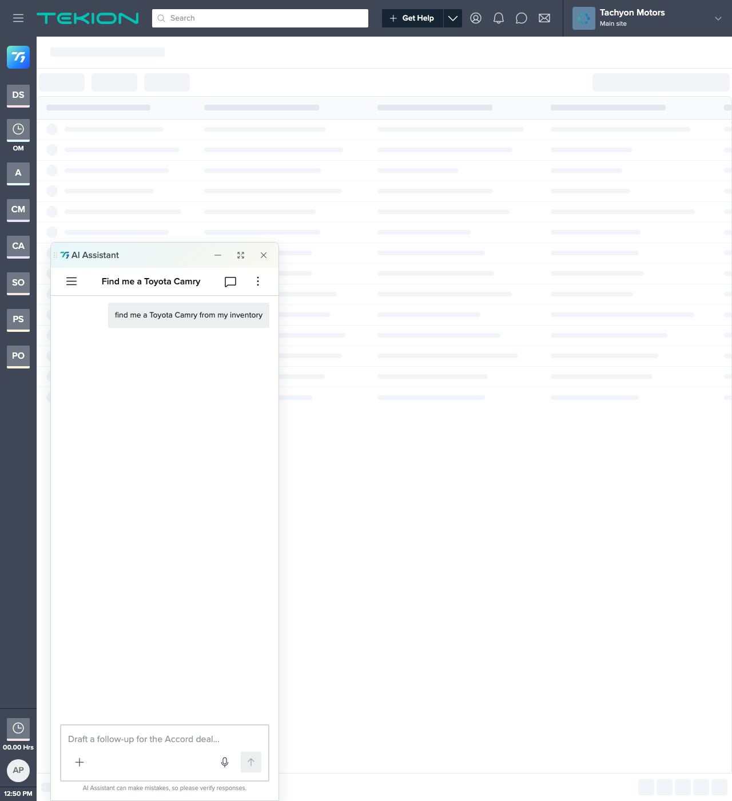

# Step 1 review — Fork the template + seed the turn

**Built:** [`Vehicle Search.html`](../Vehicle%20Search.html) — a fork of `design-systems/t1/ui_kit/template/chat-interface.html`.
**Date:** 2026-07-30  |  **Owner:** jrajan
**How to view:** serve the repo root and open `projects/t1-vehicle-search/Vehicle Search.html` (frame below captured via headless Chrome at 1280px).

Asset paths point at the read-only design system (`../../design-systems/t1/...`); no T1 files were copied into the project and the shell/chrome was not modified.

---

## AC-1 — User query renders as a right-aligned `<ChatBubble>`

The fork opens directly on the scenario: the AI panel is open (popover state), and the user's request **"find me a Toyota Camry from my inventory"** shows as a right-aligned `<ChatBubble>` in the thread. The NavBar title reflects the query ("Find me a Toyota Camry"). No welcome screen (correct — a message is seeded).

**Result:** ✅ matches spec.

## AC-11 — Single browser-openable fork, T1 components + tokens only, paths resolve, no load errors

Same frame. The full Tekion shell renders from the T1 kit — `.ts-menubar` (logo, global search, Get Help, workspace "Tachyon Motors / Main site"), `.ts-favbar` app tiles, the CRM skeleton, and the AI panel (`AppBar`, `NavBar`, `ChatBubble`, `PromptInput`) — all loaded via `loader.js` + the pre-built `components.jsx` bundle from `design-systems/t1/ui_kit/`. DOM check confirmed `ts-main__inner ts-ai--popover`, panel width 400px, bubble text and nav title correct. All five rewritten asset paths (fonts, `colors_and_type.css`, `components.css`, `manifest.js`, `loader.js` + `data-base`) resolve to real files.

**Result:** ✅ matches spec. ⚠️ Note: console shows a benign React `createRoot()` "already passed to createRoot" warning **only** when the page is re-navigated/resized in the same tab (the `t1:ready` handler re-runs `createRoot` on a fresh load); it does not appear to affect rendering and is inherited from the canonical template's mount pattern, not introduced by this fork.

---

## Checkpoint

Step 1 ACs (AC-1, AC-11) pass. No shell/chrome edits, no assets copied, no hardcoded values, work confined to `projects/t1-vehicle-search/`. Ready for designer review before Step 2 (happy-path result — summary line + `<ListingCard>`).
