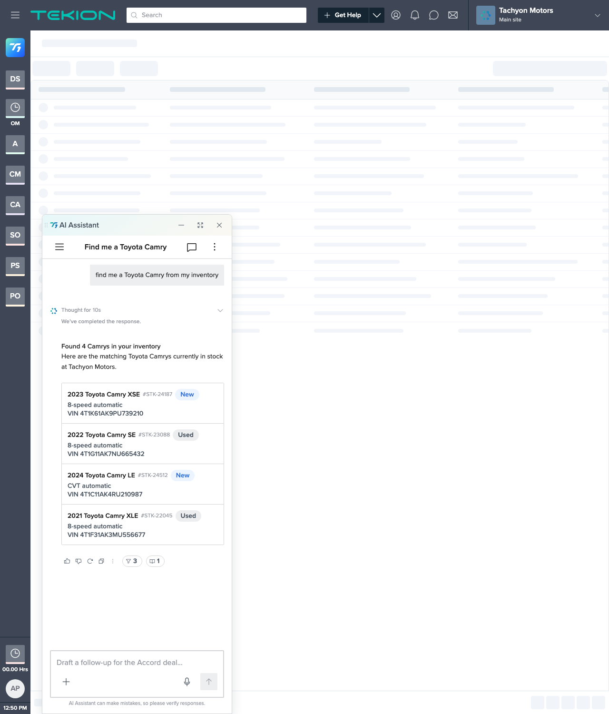

# Step 2 review — Happy-path result (summary + ListingCard)

**Built:** `vehicleSearch` entry in `RESPONSES` + `matchResponse()` route + pre-seeded assistant message in [`Vehicle Search.html`](../Vehicle%20Search.html).
**Date:** 2026-07-30  |  **Owner:** jrajan
**Field map (spec Components table):** YMMM→`title` · Stock#→`id` · Type→`chip`/`chipColor` · Transmission→`subtitle1` · VIN→`description`. (Vehicle photo → Step 3.)

---

## AC-2 — Response opens with a sentence-case count summary

The AI `<Response>` opens with the bold summary line **"Found 4 Camrys in your inventory"**, followed by the supporting body "Here are the matching Toyota Camrys currently in stock at Tachyon Motors." DOM-verified `.t1-response__title` text.

**Result:** ✅ matches spec.
⚠️ **Voice note (not a drift):** spec AC-2's example was "*I* found 4 Camrys…", but T1's brand voice (`design-systems/t1/CLAUDE.md` → Brand essentials) says avoid "I" outside the greeting. Wording adjusted to "Found 4 Camrys…" to comply; AC-2 specified the example with "e.g.", so the count-summary requirement is still met.

## AC-3 — One ListingCard, one row per vehicle

DOM check: exactly **1** `.t1-lc` (ListingCard) containing **4** `.t1-lc__item` rows — not separate cards, not hand-rolled markup. Rendered via the kit's `renderSlot` (`contentType: 'listing'` → `<ListingCard items expanded>`).

**Result:** ✅ matches spec.

## AC-4 — Each row shows the text fields (image is Step 3)

Each row surfaces YMMM (`title`, e.g. "2023 Toyota Camry XSE"), Stock# (`id`, "#STK-24187"), Transmission (`subtitle1`, "8-speed automatic" / "CVT automatic"), and VIN (`description`, "VIN 4T1K61AK9PU739210"). The Type chip is covered by AC-5. The vehicle photo thumbnail is deferred to Step 3 — the row prefix currently shows the kit's interim 40×40 letter avatar ("TC").

**Result:** ✅ text fields match spec (image pending Step 3, as planned).

## AC-5 — New/Used rendered as a Chip

Each row shows a `<Chip>` via ListingCard `chip`/`chipColor`: **New** rows use `chipColor="primary"` (blue), **Used** rows use `chipColor="neutral"` (grey) — the only two colors the kit `<Chip>` supports. DOM-verified chip labels: New, Used, New, Used.

**Result:** ✅ matches spec.

## AC-7 — Rows are display-only

`renderSlot` renders `<ListingCard>` without `onItemClick`, so per the component spec no row gets a pointer cursor and rows are non-interactive. DOM check: no row reports `cursor: pointer`.

**Result:** ✅ matches spec.

---

## Checkpoint

Step 2 ACs (AC-2, AC-3, AC-4-text, AC-5, AC-7) pass. Still only T1 kit components + tokens, single fork, shell untouched. Ready for designer review before Step 3 (vehicle photo thumbnail — the signed-off `constitution.md §5` deviation, replacing the interim "TC" avatar in the row prefix).
