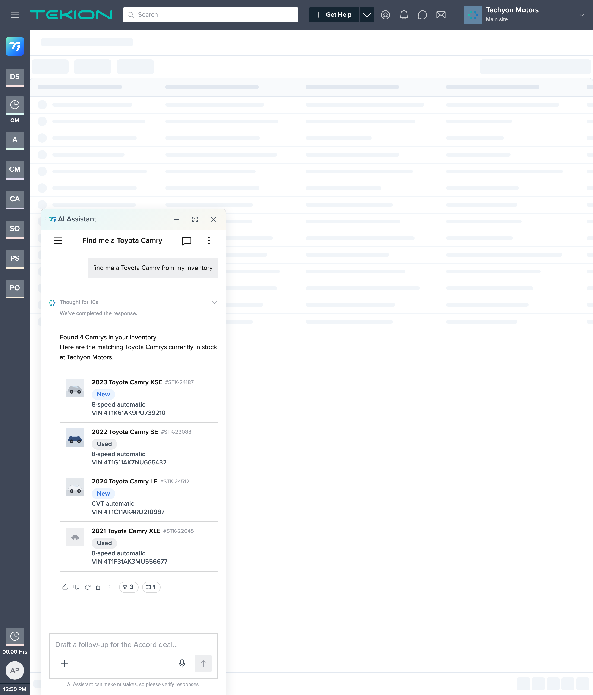

# Step 3 review — Vehicle photo thumbnail (signed-off deviation)

**Built:** fork-level `.veh-listing` thumbnail CSS in [`Vehicle Search.html`](../Vehicle%20Search.html) + 4 local assets in [`assets/vehicles/`](../assets/vehicles/). Kit untouched (read-only).
**Date:** 2026-07-30  |  **Owner:** jrajan

---

## How it was done (kit is read-only)

`ListingCard.jsx` hardcodes `<Avatar type="letter" initials=… className="t1-lc__avatar" />` and exposes no image prop, so the deviation is applied from the **fork's own `<style>`**, scoped to a `veh-listing` class passed through `renderSlot` (my code):
- Paint the vehicle photo into the existing 40×40 `.t1-lc__avatar` slot (`background-size: cover`), hide the letter initials, slot chrome via `var(--t1-radius-xs)` / `var(--t1-neutral-100)`.
- A neutral placeholder layer (`assets/vehicles/placeholder.svg`, colored to `$t1-neutral-400`) sits under every photo, so a missing **or** failed photo degrades to the placeholder — never a broken-image icon (backgrounds, not ``).

## AC-4 (image) — thumbnail present, completing the six-field row

Rows 1–3 show distinct vehicle photos (silver / blue / pearl) in the prefix slot; combined with Step 2's text fields, each row now carries all six brief fields: photo, YMMM, VIN, Stock#, Type, Transmission.
**Result:** ✅ matches spec.

## AC-6 — 40×40 at `$t1-radius-xs`; graceful placeholder, no broken icon

DOM-verified: all four slots are 40×40 with `border-radius: 2px` (`$t1-radius-xs`). **Row 4 (2021 XLE) has no photo on file → the neutral car-glyph placeholder fills the slot** (visible in the frame), demonstrating the missing state with no broken-image icon. A failed load degrades the same way (the photo is a CSS background layer; on failure the placeholder layer + `$t1-neutral-100` fill show through).
**Result:** ✅ matches spec.

## AC-11 — tokens only, no libs, within the §5 deviation

Slot chrome uses `var(--t1-*)` only; no hardcoded colors in the styling, no third-party libs, single fork, shell/chrome untouched. Photo/placeholder pixels live in local SVG assets (asset content, not styling tokens; placeholder color matched to `$t1-neutral-400`).
**Result:** ✅ matches spec — see the deviation note below.

---

## ⚠️ Decision surfaced this step — needs your explicit OK

The kit **intentionally hides** the ListingCard avatar in the narrow AI panel via `@container t1-response (max-width: 500px) { .t1-lc__avatar { display: none } }` (a space-saving choice). Our whole scenario lives in that narrow panel, and the brief requires the image there — so the `.veh-listing` rule **overrides that hide** (higher specificity, scoped, no `!important`) to bring the photo back in-panel.

This **broadens the signed-off §5 deviation**: it now also departs from T1's deliberate narrow-panel avatar-hide. Recorded in `constitution.md §5` and the tasks drift log. If you'd rather respect the kit's behavior (e.g. only show photos in the fullscreen panel, none in the docked/popover panel), say so and I'll revert the override.

## Checkpoint

Step 3 ACs (AC-4 image, AC-6, AC-11) pass. Ready for review before Step 4 (empty / no-match state), pending your call on the narrow-panel override above.
