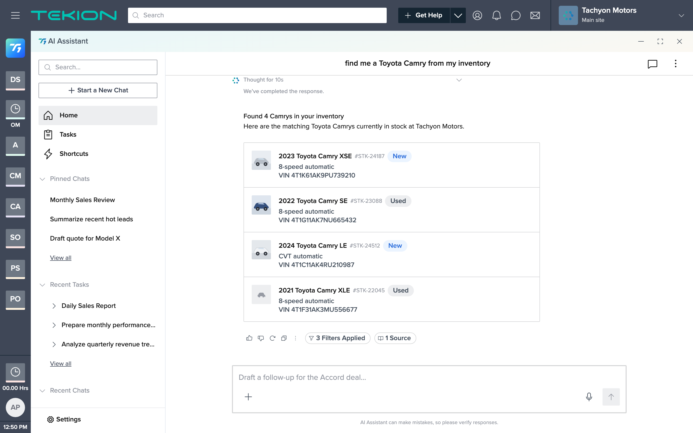
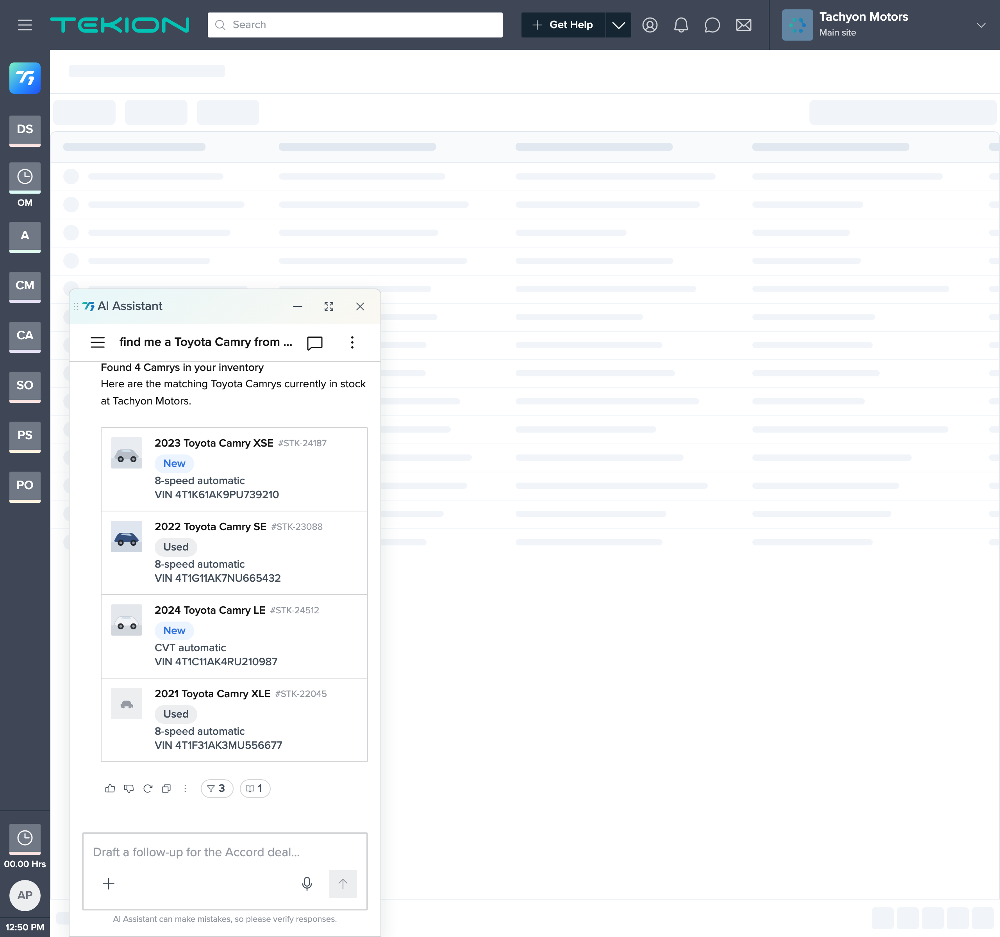

# Step 6 review — Polish + responsive + final AC pass

**Date:** 2026-07-30  |  **Owner:** jrajan
**Scope:** no new features — polish, responsive/surface checks, and a full re-confirmation of AC-1…AC-11.

## Polish applied
- **Feedback row suppressed on empty/error states** (`showFeedback={!(msg.suggestions…)}`): thumbs/copy on a "no results" or error message read oddly. DOM-verified: empty & error no longer show `.t1-fa`; the happy-path result still does.
- **`?panel=` review affordance** added (mirrors `?scenario=`) so panel surfaces (popover / left / right / fullscreen) are reviewable without manual clicks. Review-only; default remains popover.

## Surfaces & responsive

- **Fullscreen (`?panel=fullscreen`):** SideNavigation + wide ListingCard; all 4 thumbnails render (row-4 placeholder included); chips/filters/source intact. Thumbnail override holds at full width (avatar `display:grid`, 40×40).
- **Narrow panel (popover, container < 500px):** the kit's `@container t1-response` narrow layout is active (`.t1-lc__item` padding 12px, nameid wraps). **No horizontal overflow** — card `scrollW == clientW` (340), thread 398 == 398.

## Design-system integrity (AC-11)
- **Locked chrome unchanged:** diff of every `.ts-shell/.ts-menubar/.ts-body/.ts-favbar/.ts-workspace/.ts-main/.ts-crm` rule against the canonical template → **identical**.
- **All additions scoped** to `.veh-listing` / `.veh-empty-suggestions` (6 CSS rules) or the fork's JS (RESPONSES / seeds / render).
- **No hardcoded colors** in the added style rules — tokens only (`var(--t1-*)`); photo/placeholder colors live in local SVG assets (asset content), placeholder matched to `$t1-neutral-400`.
- No third-party libraries; single browser-openable fork; work confined to `projects/t1-vehicle-search/`.

## Final AC pass (all re-confirmed in-browser)
| AC | Status | Where |
|----|--------|-------|
| AC-1 user `<ChatBubble>` | ✅ | all scenarios |
| AC-2 count summary line | ✅ | match ("Found 4 Camrys…") |
| AC-3 one `<ListingCard>`, 4 rows | ✅ | match (DOM 1 card / 4 rows) |
| AC-4 six fields incl. photo | ✅ | match + Step 3 |
| AC-5 New/Used `<Chip>` | ✅ | match |
| AC-6 40×40 `$t1-radius-xs`; placeholder, no broken icon | ✅ | Step 3 (row-4 placeholder) |
| AC-7 rows display-only | ✅ | match (no pointer) |
| AC-8 empty + suggestions, no card | ✅ | `?scenario=empty` |
| AC-9 searching state, no card | ✅ | `?scenario=loading` |
| AC-10 error + Try again, no card | ✅ | `?scenario=error` |
| AC-11 tokens/components only, shell untouched | ✅ | diff + scope checks above |

## Checkpoint — project complete
All 11 acceptance criteria pass across all four states and both panel surfaces. One signed-off deviation (`constitution.md §5`: vehicle thumbnail + narrow-panel avatar-hide override). Ready for final sign-off.
