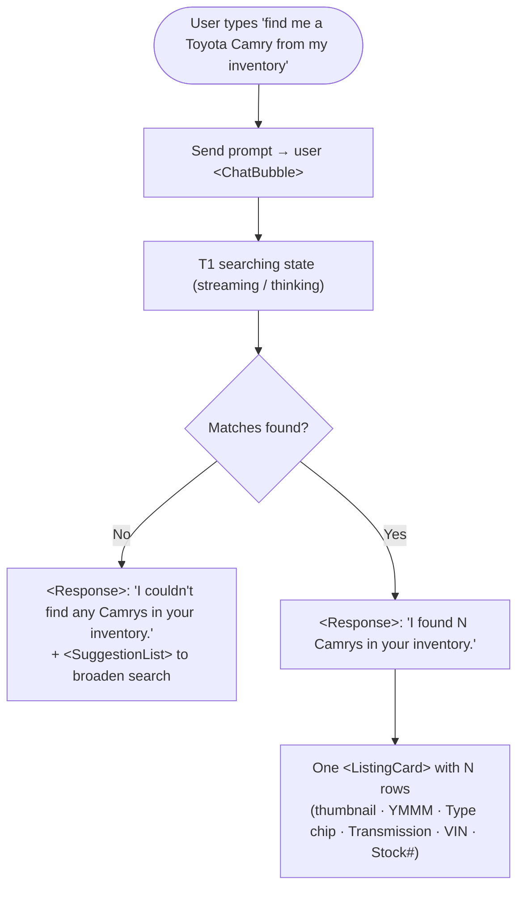
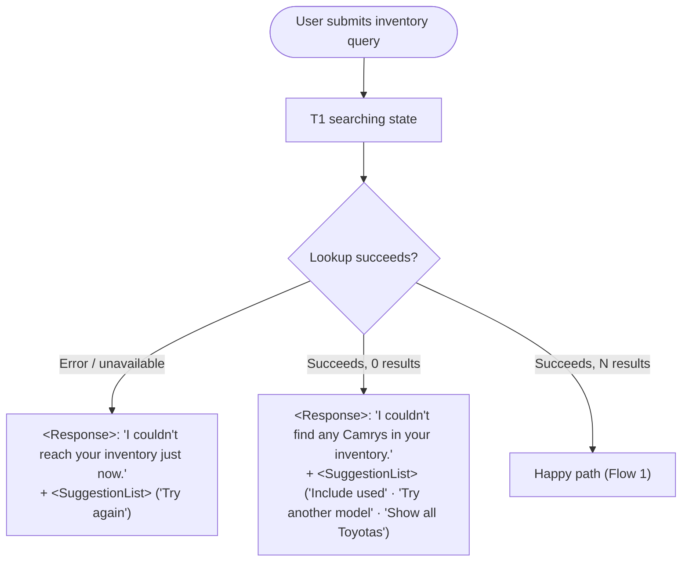

# t1-vehicle-search — Spec

> **t1-vehicle-search** lets a dealership salesperson find matching vehicles in their own inventory by asking T1 in plain language (e.g. *"find me a Toyota Camry from my inventory"*). T1 answers conversationally with a one-line summary of how many matches it found and surfaces the matching vehicles as scannable rows in a single `<ListingCard>` inside the AI response — each row showing the vehicle's year/make/model, VIN, stock number, photo, new/used type, and transmission. It turns an inventory lookup that would otherwise mean leaving the assistant and searching the DMS into a single in-chat turn.

**Owner:** jrajan  |  **Last updated:** 2026-07-30
**Source:** `brief.md` (designer paste, 2026-07-30)  |  **Design system:** t1  |  **Completeness after clarify:** Problem 🟢 · Scope 🟢 · Flows 🟢 · Components 🟢 · States 🟢 · AC 🟢

> **How to use this file:** The two biggest failure modes are *ambiguity* (Claude fills gaps with guesses) and *drift* (Claude forgets decisions over a long session). This spec kills ambiguity up front. Be concrete: name real components, real states, real copy. Vague specs produce vague UI.

---

## Problem

- **Who** is the user? A dealership **salesperson** working inside the Tekion platform with the T1 AI assistant panel open.
- **What** are they trying to accomplish? Quickly find which vehicles in *their own dealership inventory* match a natural-language request (make/model, and by extension year, new/used), without leaving the conversation.
- **Why** does the current experience fall short? Finding matching stock today means switching out of the assistant into the DMS/inventory tool, filtering manually, and reading dense tables. The salesperson wants an instant, scannable answer in the same chat turn where they asked.

## Scope

**In scope (v1):**
- A single conversational turn: the user asks for a vehicle in their inventory → T1 responds.
- An AI `<Response>` with a plain-language summary line stating the match count (e.g. *"I found 4 Camrys in your inventory."*).
- Matching vehicles rendered as rows in **one** `<ListingCard>`, one row per vehicle. Each row shows: **YMMM** (year + make + model + trim), **VIN**, **Stock #**, **vehicle photo thumbnail**, **Type** (New/Used), **Transmission**.
- The three unhappy states for that turn: **no matches**, **searching (loading)**, **lookup error**.

**Explicitly out of scope (v1):** (these are what stop drift)
- Row interactivity — rows are **display-only**; no click-through to a vehicle detail view, no per-row action buttons.
- Filtering, sorting, or refine controls in the response (no dropdowns/chips to narrow results in-card).
- Pagination / "show more" for large result sets, and any defined cap on how many rows render.
- Multi-turn refinement flows, comparison of vehicles, or editing/updating inventory data.
- The natural-language parsing itself (how the query maps to inventory fields) — this spec covers the **response UI only**, assuming matches are supplied.
- Price, mileage, color, location, or any vehicle field not listed above.

---

## User Flows

### Flow 1: Inventory search — happy path

The user asks for a vehicle; T1 confirms the count and lists the matching vehicles as rows in one `<ListingCard>`.

### Flow 2: Unhappy paths — empty & error

Covers the no-match result and a failed inventory lookup.

---

## Components

Every component maps to a real T1 component (per `constitution.md §3` and `design-systems/t1/ui_kit/docs/INDEX.md`).

| Component | Design-system source | Notes |
|-----------|----------------------|-------|
| User query bubble | `<ChatBubble>` (Chat-Bubble) | Right-aligned user message, e.g. "find me a Toyota Camry from my inventory". |
| AI reply frame | `<Response>` inside `<ChatContainer>` | Holds the summary line + the results card (or the empty/error message). |
| Summary line | Text inside `<Response>` | Sentence-case count line: "I found 4 Camrys in your inventory." |
| Vehicle results list | `<ListingCard>` (Listing-Card) | **One** card, one row per vehicle. Field mapping below. |
| Type indicator (New/Used) | `<Chip>` via ListingCard row `chip`/`chipColor` | "New" / "Used" per row. |
| Vehicle photo thumbnail | ListingCard row prefix slot — **deviation** | ⚠️ **Gap:** ListingCard has no image field; it renders an initials avatar. Per `constitution.md §5`, a vehicle photo thumbnail replaces the avatar in the 40×40px prefix slot (signed-off deviation). Candidate for an upstream `image` prop. |
| Broaden-search follow-ups | `<SuggestionList>` (Suggestion-List) | Shown only in empty and error responses. |
| Searching indicator | Template streaming / thinking state | Native to the forked `chat-interface.html`; not a new component. |

**ListingCard row → brief field mapping** (`expanded=true`, one item per vehicle):

| Brief field | ListingCard item field | Example |
|---|---|---|
| Image | prefix slot (thumbnail — deviation) | vehicle photo, 40×40, `$t1-radius-xs` |
| YMMM (year/make/model/trim) | `title` | "2023 Toyota Camry XSE" |
| Stock # | `id` | "#STK-4821" |
| Type (New/Used) | `chip` + `chipColor` | "Used" / "New" |
| Transmission | `subtitle1` | "Automatic" |
| VIN | `description` | "VIN 4T1BZ1HK5PU123456" |

---

## States

| Screen / component | Empty | Loading | Error | Success / populated |
|--------------------|-------|---------|-------|---------------------|
| Inventory search response (`<Response>`) | `<Response>` line "I couldn't find any Camrys in your inventory." + `<SuggestionList>` (broaden search). No `<ListingCard>`. | Template searching/streaming state after the user `<ChatBubble>`; no card yet. | `<Response>` line "I couldn't reach your inventory just now." + `<SuggestionList>` with "Try again". | Summary line "I found N Camrys in your inventory." + one `<ListingCard>` with N vehicle rows. |
| Vehicle results `<ListingCard>` | Not rendered (empty handled at response level). | Not rendered while searching. | Not rendered (error handled at response level). | N rows, each: thumbnail · YMMM (`title`) · Type (`chip`) · Transmission (`subtitle1`) · VIN (`description`) · Stock# (`id`). Rows are display-only (no hover pointer / no `onItemClick`). |
| Vehicle row thumbnail | — | — | Missing/failed photo → neutral placeholder in the same 40×40 slot (no broken image), styled with `$t1-*` tokens. | Vehicle photo, 40×40px, `$t1-radius-xs`. |

---

## Acceptance criteria

Concrete, checkable statements with stable IDs. `tasks.md` traces each task back to the AC it satisfies. IDs are stable — never renumber or reuse; add new ones at the end.

- **AC-1** — When the user sends an inventory query, the thread shows their request as a right-aligned `<ChatBubble>`.
- **AC-2** — On a successful search with matches, T1 renders a `<Response>` whose first line is a sentence-case summary stating the match count and the queried model (e.g. "I found 4 Camrys in your inventory.").
- **AC-3** — Matching vehicles render as rows in a **single** `<ListingCard>` (one row per vehicle), not as separate cards and not as hand-rolled markup.
- **AC-4** — Each vehicle row displays all six fields: vehicle photo thumbnail, YMMM (year/make/model/trim), VIN, Stock #, Type (New/Used), and Transmission — mapped to ListingCard fields per the Components table.
- **AC-5** — The New/Used type is shown as a `<Chip>` within the row (via ListingCard `chip`/`chipColor`).
- **AC-6** — The vehicle photo appears in the row's 40×40px prefix slot at `$t1-radius-xs`; if a photo is missing or fails to load, a neutral token-styled placeholder fills the same slot (no broken-image icon).
- **AC-7** — Vehicle rows are display-only in v1: no click-through, no per-row action buttons, and the row does not show a pointer cursor.
- **AC-8** — When the search returns zero matches, T1 renders a `<Response>` stating no vehicles were found (e.g. "I couldn't find any Camrys in your inventory.") followed by a `<SuggestionList>` offering ways to broaden the search; no `<ListingCard>` is shown.
- **AC-9** — While the search is running, T1 shows the template's searching/streaming state (no results card yet); the results card appears only once results resolve.
- **AC-10** — When the inventory lookup fails, T1 renders a `<Response>` stating it couldn't reach inventory, with a `<SuggestionList>` that includes a "Try again" action; no `<ListingCard>` is shown.
- **AC-11** — All output is composed inside a fork of `design-systems/t1/ui_kit/template/chat-interface.html` using T1 kit components and `$t1-*` tokens only — no raw HTML cards, no third-party libraries, no hardcoded colors/sizes; the vehicle-thumbnail deviation stays within the constraints recorded in `constitution.md §5`.

> Every AC must be covered by at least one task in `tasks.md`; every task must cite an AC.
