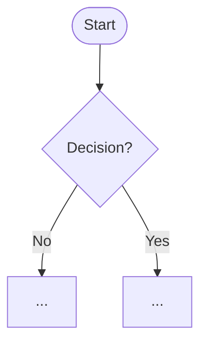

# {{PROJECT_NAME}} — Spec

> One paragraph: what is this, who is it for, and what does it let them do? Write this so someone who has never seen the project understands it. This blockquote is the single source of truth for scope — if a request doesn't fit here, it's out of scope until the spec changes.

**Owner:** {{DESIGNER_NAME}}  |  **Last updated:** {{DATE}}

> **How to use this file:** The two biggest failure modes are *ambiguity* (Claude fills gaps with guesses) and *drift* (Claude forgets decisions over a long session). This spec kills ambiguity up front. Be concrete: name real components, real states, real copy. Vague specs produce vague UI.

---

## Problem

- **Who** is the user? {{role}}
- **What** are they trying to accomplish? {{job to be done}}
- **Why** does the current experience fall short? {{the gap}}

## Scope

**In scope:**
- {{bullet}}

**Explicitly out of scope:** (write these down — they're what stops drift)
- {{bullet}}

---

## User Flows

Describe each flow in one sentence, then a mermaid `flowchart TD`. Cover the unhappy paths (unauthorized, empty, error), not just the happy path.

### Flow 1: {{name}}

{{one-sentence description}}

---

## Components

List every component the screens use. For each, name the **design-system component** it maps to (per constitution §3). If none maps, mark it a **gap** — do not invent one.

| Component | Design-system source | Notes |
|-----------|----------------------|-------|
| {{e.g. Section card}} | {{ds/Card}} | {{}} |

---

## States

For every component/screen, define all four states. Missing states are the #1 cause of "this isn't what I wanted."

| Screen / component | Empty | Loading | Error | Success / populated |
|--------------------|-------|---------|-------|---------------------|
| {{}} | {{}} | {{}} | {{}} | {{}} |

---

## Acceptance criteria

Concrete, checkable statements. These become the tasks. Write them the way the team's shipped specs do — one behavior per bullet.

- {{The page displays ...}}
- {{On click of X, ...}}
- {{When data is unavailable, ...}}
